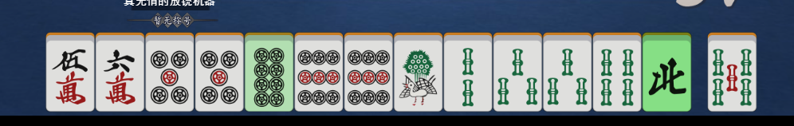
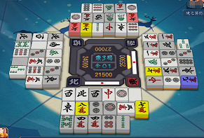
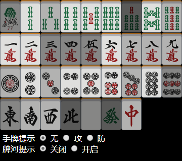

# 雀魂麻将牌效辅助 
感谢 [FlyingBamboo](https://github.com/FlyingBamboo) 的巨大贡献

## <b style="color: pink">本项目仅供学习研究使用，使用此脚本进行游戏会导致您被官方封禁。</b>

1. 使用天凤牌理规则，根据牌效将推荐的切牌染色。

2. 对河牌、副露牌进行染色，包括：

   - 别家，红：筋，蓝：现物，黄：壁候选牌；颜色越深越有用。

   - 自家，仅显示河牌和副露牌中的壁候选牌和现物

3. 摸切的河牌灰色提示

4. 挤房间功能

5. 显示玩家段位

  
  
  
  

### 安装方法 - 浏览器
- 安装油猴脚本 TamperMonkey 
- 导入 **main.js** 或打开 [此链接](https://greasyfork.org/scripts/378059-majsoul-helper) 安装脚本

### 安装方法 - Majsoul Plus
- 在 **resources\app\execute** 中新建文件夹
- 将 **execute.json** 、 **main.js** 文件复制到该文件夹

### 使用方法
- 单击右下角按钮打开控制界面

- 自动和了按钮默认开启

- 高速加入房间功能

  如需高速加入房间（如房间 0000 ），请打开控制台 输入 `add = new AddRoom(0000).start();`

  停止加入，请输入 `add.stop();`
